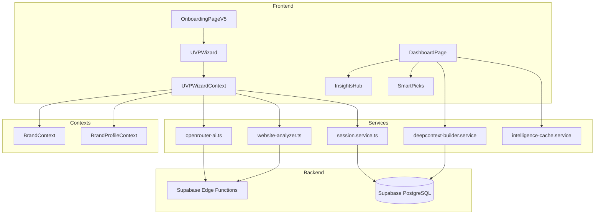
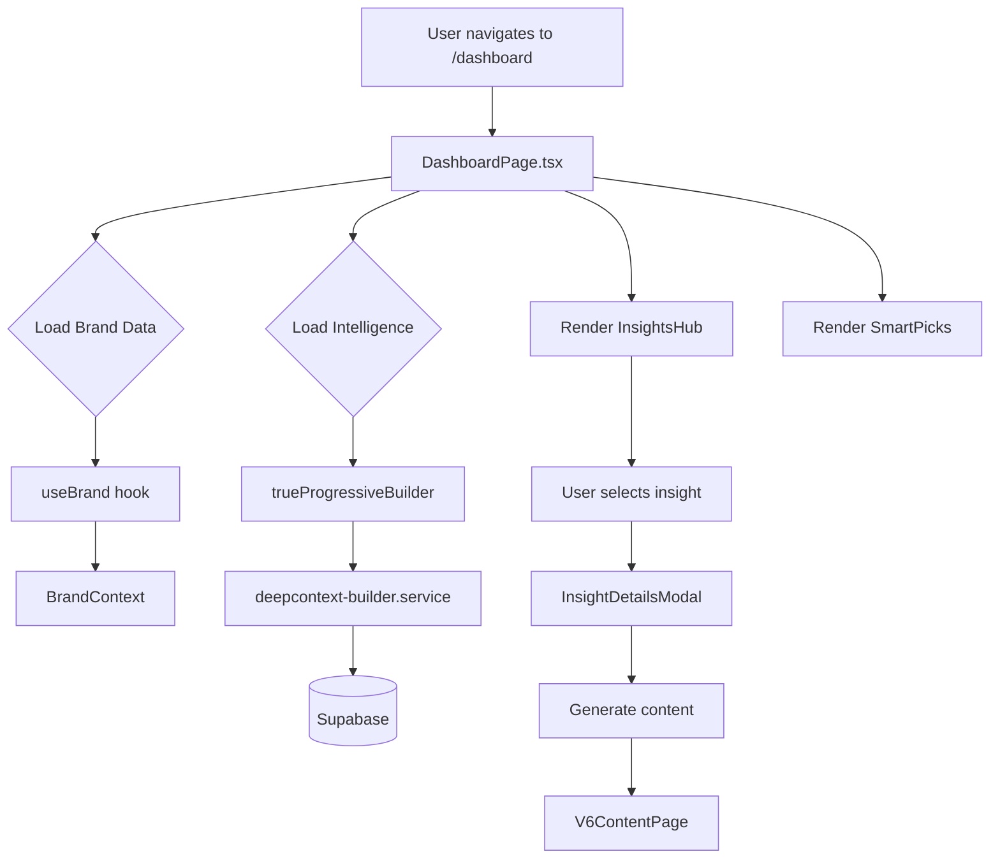
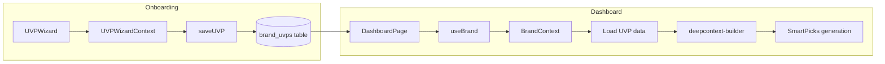
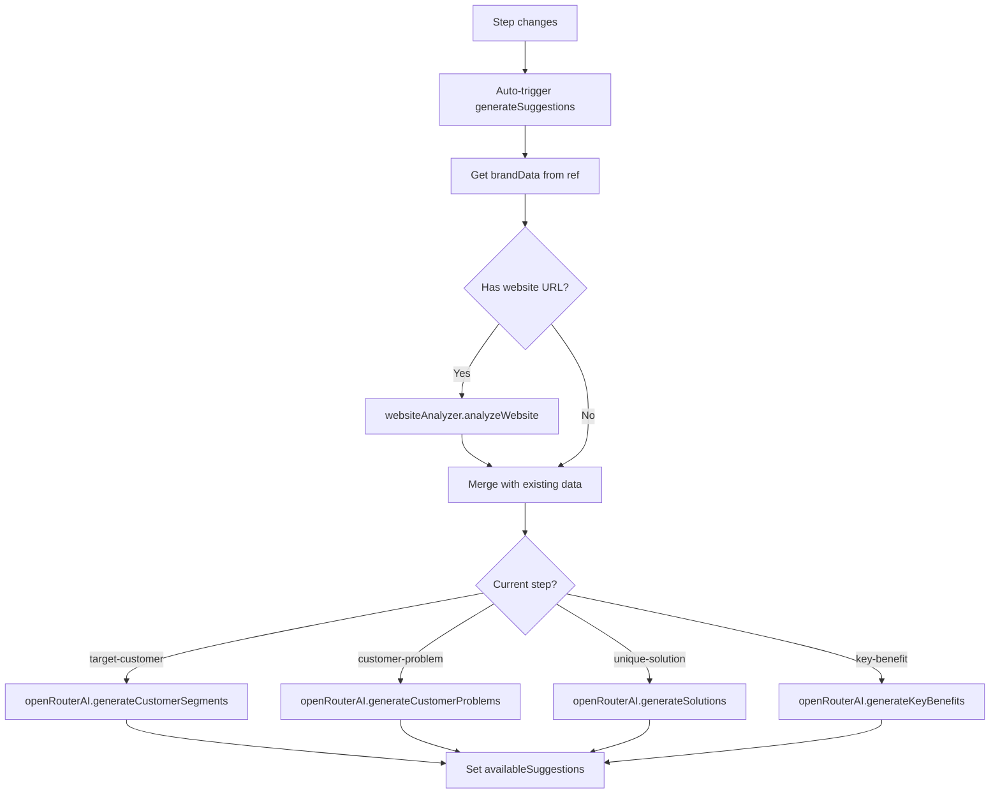

# Synapse - Architecture Map

> **Purpose:** Prevent Claude from reinventing structures. This is the authoritative map of how Synapse works.

---

## System Overview



---

## Process Flows

### UVP Wizard Flow (Onboarding)

**Entry Point:** `src/pages/OnboardingPageV5.tsx` → Route: `/` or `/onboarding`

```mermaid
graph LR
    A[User lands on /] --> B[OnboardingPageV5]
    B --> C[UVPWizardProvider wraps]
    C --> D[UVPWizard.tsx]
    D --> E{Step Navigation}
    E --> F[welcome]
    E --> G[target-customer]
    E --> H[customer-problem]
    E --> I[unique-solution]
    E --> J[key-benefit]
    E --> K[review]
    E --> L[complete]
    L --> M[/dashboard]
```

**Flow Steps:**
1. User arrives → `OnboardingPageV5.tsx`
2. `UVPWizardProvider` wraps entire wizard (provides context)
3. `UVPWizard.tsx` renders current step
4. Each step collects data → stored in `UVPWizardContext` state
5. `updateField()` triggers auto-save after 1 second debounce
6. Data saves to `brand_uvps` table (if brandId) or `uvp_sessions` table (onboarding)
7. On complete → redirect to `/dashboard`

**Critical Files:**
| File | Purpose | Lines |
|------|---------|-------|
| `src/contexts/UVPWizardContext.tsx` | Central state for wizard | 763 |
| `src/components/uvp-wizard/UVPWizard.tsx` | Main wizard component | ~850 |
| `src/services/uvp-wizard/openrouter-ai.ts` | AI suggestions via Claude | ~1000 |
| `src/services/uvp-wizard/website-analyzer.ts` | Deep website analysis | ~300 |
| `src/config/uvp-wizard-steps.ts` | Step configuration | ~100 |

**Database Tables:**
- `brand_uvps` - Stored UVP data (linked to brand)
- `uvp_sessions` - Temporary session storage during onboarding
- `brands` - Brand profile data

---

### Dashboard Flow

**Entry Point:** `src/pages/DashboardPage.tsx` → Route: `/dashboard`



**Flow Steps:**
1. User lands on `/dashboard`
2. `useBrand()` hook loads current brand from context
3. `trueProgressiveBuilder` builds DeepContext progressively
4. `InsightsHub` displays available intelligence
5. `SmartPicks` shows top campaign/content recommendations
6. User can drill into insights → `InsightDetailsModal`
7. Generate content → redirects to `/v6` (V6ContentPage)

**Critical Files:**
| File | Purpose |
|------|---------|
| `src/pages/DashboardPage.tsx` | Main dashboard page |
| `src/components/dashboard/InsightsHub.tsx` | Intelligence display |
| `src/components/dashboard/DashboardSmartPicks.tsx` | Campaign recommendations |
| `src/services/intelligence/deepcontext-builder-progressive.service.ts` | Progressive context building |
| `src/services/dashboard/dashboard-preloader.service.ts` | Preload intelligence data |

---

### UVP → Dashboard Connection



**How UVP connects to Dashboard:**
1. UVP wizard saves to `brand_uvps` table via `saveUVP()` in UVPWizardContext
2. Dashboard loads brand via `useBrand()` hook
3. Brand includes UVP data (`target_customer`, `customer_problem`, `unique_solution`, `key_benefit`)
4. DeepContext builder uses UVP to generate personalized intelligence
5. SmartPicks uses UVP for campaign recommendations

---

### AI Suggestion Generation

**Entry Point:** `UVPWizardContext.generateSuggestions()`



**Critical Files:**
| File | Purpose |
|------|---------|
| `src/services/uvp-wizard/openrouter-ai.ts` | Claude Opus 4.1 for suggestions |
| `src/services/uvp-wizard/website-analyzer.ts` | Deep website scraping |
| `src/services/uvp-wizard/fallback-suggestions.ts` | Industry fallbacks |
| `src/services/uvp-wizard/industry-ai.ts` | Industry-specific prompts |

---

## Critical Files - HANDLE WITH CARE

These files are battle-tested and widely used. You CAN modify them when needed, but:

1. **READ** the entire file first
2. **UNDERSTAND** what imports it (check "Imported By" count)
3. **MAINTAIN** existing exports/API signatures
4. **TEST** affected pages after changes
5. **ASK** before restructuring or renaming exports
6. **NEVER** recreate from scratch - extend instead

### CORE (Highest Risk - App Won't Load If Broken)

| File | Imported By | Lines | Why Critical |
|------|-------------|-------|--------------|
| `src/lib/supabase.ts` | 812 | 467 | Database connection - break this = app dies |
| `src/types/index.ts` | 507 | 225 | All TypeScript types - break this = nothing compiles |
| `src/App.tsx` | - | 102 | All routing and provider setup |
| `src/main.tsx` | - | 24 | React initialization |

### CONTEXTS (State Management - Cascading Failures)

| File | Imported By | Lines | Why Critical |
|------|-------------|-------|--------------|
| `src/contexts/BrandContext.tsx` | 11 | 334 | Brand selection, streaming prefetch, used everywhere |
| `src/contexts/UVPWizardContext.tsx` | 1 | 762 | Entire onboarding wizard state and flow |
| `src/contexts/BrandProfileContext.tsx` | 5 | - | Extended brand profile data |
| `src/contexts/BuyerJourneyContext.tsx` | 2 | 640 | Buyer persona journey state |
| `src/contexts/UVPContext.tsx` | - | 617 | UVP canvas builder state |

### HOOKS (Reusable Logic - Many Dependents)

| File | Imported By | Lines | Why Critical |
|------|-------------|-------|--------------|
| `src/hooks/useBrand.ts` | 26 | 21 | Brand access - used across entire app |
| `src/hooks/useProducts.ts` | 26 | 360 | Product CRUD, website rescanning |
| `src/hooks/useCompetitorIntelligence.ts` | - | 1,263 | Gap Tab v2, competitor discovery |
| `src/hooks/useStreamingApiData.ts` | - | 359 | Core streaming architecture |
| `src/hooks/useOptimizedAPIData.tsx` | - | 401 | API caching layer |

### SERVICES (Business Logic - Core Features)

| File | Imported By | Lines | Why Critical |
|------|-------------|-------|--------------|
| `src/services/intelligence/streaming-deepcontext-builder.service.ts` | 9 | 6,188 | Largest file - generates all brand intelligence |
| `src/services/intelligence/streaming-api-manager.ts` | 13 | 4,071 | API orchestration - controls which APIs run |
| `src/services/intelligence/competitor-intelligence.service.ts` | 42 | 2,291 | Gap Tab feature |
| `src/services/intelligence/content-synthesis.service.ts` | 13 | 2,533 | Content generation |
| `src/services/uvp-wizard/openrouter-ai.ts` | - | ~1000 | AI suggestions via Claude |

### PAGES (Major Features)

| File | Imported By | Lines | Why Critical |
|------|-------------|-------|--------------|
| `src/pages/OnboardingPageV5.tsx` | 2 | 3,281 | Main onboarding flow |
| `src/pages/DashboardPage.tsx` | 2 | 1,052 | Main dashboard |
| `src/pages/SynapsePage.tsx` | - | 1,409 | Content generation hub |
| `src/pages/BrandProfilePage.tsx` | 2 | 1,549 | Brand profile management |

### CONFIG (App Behavior)

| File | Lines | Why Critical |
|------|-------|--------------|
| `src/config/uvp-wizard-steps.ts` | 348 | UVP wizard step definitions |
| `src/lib/constants.ts` | 267 | Global constants, API limits |
| `src/lib/platform-apis.ts` | 579 | Platform API configuration |

### Before Modifying Any Critical File

```
STOP and verify:
[ ] I've read the entire file
[ ] I know what files import this (check table above)
[ ] My change maintains existing exports
[ ] I'll test affected pages after
[ ] If restructuring: I've asked the user first
```

---

## Directory Structure

```
src/
├── components/
│   ├── uvp-wizard/       # UVP wizard components
│   │   ├── UVPWizard.tsx         # Main wizard
│   │   ├── screens/              # Step screens
│   │   └── ...support components
│   ├── uvp-flow/         # Alternative UVP flow components
│   ├── dashboard/        # Dashboard components
│   │   ├── InsightsHub.tsx
│   │   ├── DashboardSmartPicks.tsx
│   │   └── ...
│   ├── ui/               # Base UI components (shadcn)
│   ├── layout/           # App layout (sidebar, etc.)
│   └── ...
├── contexts/
│   ├── UVPWizardContext.tsx  # UVP wizard state
│   ├── BrandContext.tsx      # Brand state
│   ├── BrandProfileContext.tsx
│   └── ...
├── services/
│   ├── uvp-wizard/       # UVP-specific services
│   │   ├── openrouter-ai.ts
│   │   ├── website-analyzer.ts
│   │   └── ...
│   ├── intelligence/     # Intelligence building
│   ├── dashboard/        # Dashboard services
│   ├── session/          # Session management
│   └── ...
├── hooks/
│   ├── useBrand.ts       # Brand access hook
│   └── ...
├── pages/
│   ├── OnboardingPageV5.tsx  # Entry point for UVP
│   ├── DashboardPage.tsx     # Main dashboard
│   ├── V6ContentPage.tsx     # Content generation
│   └── ...
├── types/
│   ├── uvp-wizard.ts     # UVP types
│   └── ...
├── config/
│   ├── uvp-wizard-steps.ts   # Step configuration
│   └── ...
└── lib/
    ├── supabase.ts       # Supabase client
    └── ...

supabase/
├── functions/            # Edge functions (API proxy)
│   ├── ai-proxy/
│   ├── fetch-serper/
│   ├── fetch-youtube/
│   └── ...30+ functions
└── migrations/           # Database migrations
```

---

## Key Patterns

### 1. Context Pattern for State
All major features use React Context:
- `UVPWizardContext` - UVP wizard state
- `BrandContext` - Current brand
- `BrandProfileContext` - Extended profile

**Pattern:** Provider wraps App, hooks provide access

```typescript
// Access brand anywhere
const { currentBrand } = useBrand();

// Access UVP wizard (inside wizard only)
const { uvp, updateField, goNext } = useUVPWizard();
```

### 2. Auto-Save Pattern
UVP uses debounced auto-save:
1. User edits field
2. `updateField()` called
3. 1 second timer starts
4. If no more changes, `saveUVP()` executes
5. Saved to Supabase

### 3. Edge Function Proxy Pattern
All external APIs go through edge functions:
```
Frontend → Edge Function → External API
           (supabase/functions/*)
```

Never call external APIs directly from frontend.

### 4. Progressive Loading Pattern
Dashboard uses progressive context building:
1. Load cached data immediately
2. Start background refresh
3. Update UI as new data arrives

---

## Tech Stack

### Frontend
- **Framework:** React 18
- **Router:** React Router v6
- **Styling:** Tailwind CSS
- **UI:** Radix UI, shadcn, Aceternity, Magic UI
- **State:** React Context + hooks
- **Animation:** Framer Motion

### Backend
- **Database:** Supabase PostgreSQL
- **Edge Functions:** Deno (TypeScript)
- **Auth:** Supabase Auth
- **Storage:** Supabase Storage

### AI
- **Primary:** OpenRouter → Claude Opus 4.1
- **Fallback:** Industry-specific suggestions

---

## Blocked Dependencies

**DO NOT USE these UI libraries:**
- @chakra-ui/*
- @mui/*
- antd
- @headlessui/*
- @mantine/*

**Use instead:** ~/Projects/ui-libraries/ (shadcn, aceternity, magic-ui, catalyst-ui, radix)

---

## Security Requirements

1. **RLS on ALL tables** - No exceptions
2. **Edge functions for external APIs** - Never call from frontend
3. **Secrets in .env only** - Never hardcode
4. **Validate auth on every request**

---

## Examples Reference

See `/examples` folder for:
- API integration patterns
- Component structure patterns
- Hook patterns
- Service patterns

**ALWAYS check examples before implementing new features.**

---

## Architectural Decisions

See `docs/decisions/` for ADRs explaining:
- Why Supabase over Firebase
- Why React Context over Redux
- Why OpenRouter for AI

---

*Last updated: December 3, 2025*
*DO NOT delete or recreate this file. Update it when architecture changes.*
