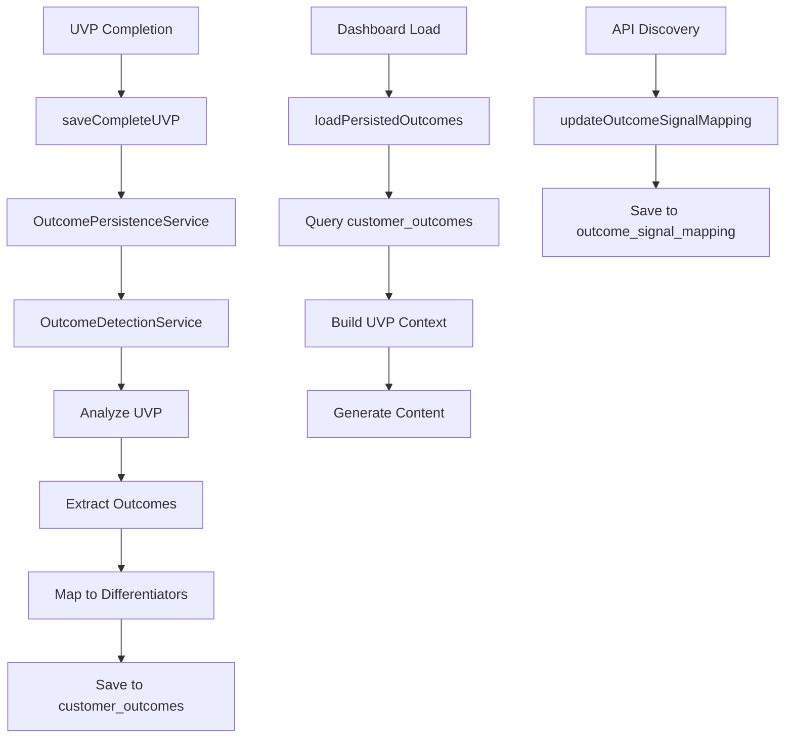

# Outcome Persistence Integration

## Overview

This document describes the integration between the Outcome Detection Service and UVP workflow to persist customer outcomes to the database.

## Architecture



## Integration Points

### 1. UVP Completion Flow

**File:** `/src/services/database/marba-uvp.service.ts`

**When:** After UVP is saved to `marba_uvps` table

**What:**
- Finds or creates UVP session for the brand
- Calls `outcomePersistenceService.saveOutcomesToSession()`
- Detects outcomes from CompleteUVP
- Saves outcomes to `customer_outcomes` table

**Code Location:** Lines 244-297

```typescript
// SYNAPSE-V6: Persist customer outcomes to database
const outcomeResult = await outcomePersistenceService.saveOutcomesToSession(
  sessionId,
  uvp
);
```

### 2. Context Building

**File:** `/src/services/synapse-v6/uvp-context-builder.service.ts`

**When:** Building UVP context for content generation

**What:**
- Loads persisted outcomes from database if available
- Falls back to on-the-fly detection if no persisted outcomes
- Attaches outcomes to UVPQueryContext

**Code Location:** Lines 1437-1465

```typescript
// Build UVP context with persisted outcomes
const context = await buildUVPContextWithOutcomes(uvp, brandId);
// context.detectedOutcomes contains persisted outcomes
```

### 3. API Signal Tracking (Future)

**File:** `/src/services/synapse-v6/outcome-persistence.service.ts`

**When:** After API calls return VoC insights

**What:**
- Updates `outcome_signal_mapping` table
- Tracks which API queries successfully found signals for which outcomes

**Usage:**
```typescript
await outcomePersistenceService.updateOutcomeSignalMapping(
  outcomeId,
  'serper',
  'customer acquisition insurance',
  85, // signal strength
  {
    conversationThemes: ['price concerns', 'trust issues'],
    buyingSignals: ['comparing options', 'budget approved'],
  }
);
```

## Database Schema

### customer_outcomes Table

Stores detected customer outcomes with UVP alignment.

**Key Fields:**
- `uvp_session_id` - Links to UVP session (foreign key)
- `outcome_statement` - The actual desired outcome text
- `outcome_category` - Categorized as revenue/efficiency/compliance/etc
- `priority_score` - 1-100 based on impact score
- `matched_differentiator` - UVP differentiator that addresses this outcome
- `differentiator_strength` - 1-100 match strength
- `primary_keywords` - Keywords extracted from outcome
- `outcome_queries` - Generated API queries for this outcome

**RLS Policies:**
- Users can only access outcomes for their own brands
- Enforced through `uvp_sessions.brand_id -> brands.user_id` chain

### outcome_signal_mapping Table

Tracks which API calls found signals for which outcomes.

**Key Fields:**
- `customer_outcome_id` - Links to customer outcome
- `api_source` - Which API (serper, reddit, reviews, etc)
- `query_used` - The actual query that was executed
- `signal_strength` - 1-100 how strong the signal is
- `conversation_themes` - Discovered conversation themes
- `buying_signals` - Detected buying signals
- `competitor_mentions` - Competitor references found

**RLS Policies:**
- Inherits access through `customer_outcomes` relationship

## Data Flow

### UVP Completion to Outcome Persistence

1. User completes UVP in onboarding
2. `saveCompleteUVP()` saves to `marba_uvps` table
3. System finds or creates `uvp_sessions` record
4. `outcomePersistenceService.saveOutcomesToSession()` called
5. `outcomeDetectionService.detectOutcomes()` analyzes UVP
6. Outcomes extracted from:
   - Customer profiles (emotional/functional drivers)
   - Transformation goals (before/after, desired outcomes)
   - Key benefits
7. Outcomes mapped to differentiators with strength scoring
8. Database rows created in `customer_outcomes` table
9. Process is idempotent (can be called multiple times)

### Context Building with Persisted Outcomes

1. Dashboard loads brand data
2. `buildUVPContextWithOutcomes()` called
3. Queries `uvp_sessions` for most recent session
4. Loads outcomes from `customer_outcomes` table
5. If no persisted outcomes, detects on-the-fly
6. Returns `UVPQueryContext` with `detectedOutcomes` field
7. Outcomes used in:
   - Query generation
   - VoC insight synthesis
   - Content personalization

## Service API

### OutcomePersistenceService

**saveOutcomesToSession(uvpSessionId, uvp, industryBooster?)**
- Detects and saves outcomes for a UVP session
- Returns: `{ success, outcomeIds, count, error? }`
- Idempotent: Safe to call multiple times

**loadOutcomesForSession(uvpSessionId)**
- Loads persisted outcomes from database
- Returns: `{ success, outcomes, mappings, error? }`
- Used when rebuilding context from existing data

**updateOutcomeSignalMapping(outcomeId, apiSource, query, strength, data)**
- Tracks API signal discovery for outcomes
- Returns: `{ success, error? }`
- Called after API calls complete

**deleteOutcomesForSession(uvpSessionId)**
- Cleanup operation
- Returns: `{ success, error? }`
- Cascades through outcome_signal_mapping

## Error Handling

All outcome persistence operations are **non-critical**:
- Failures logged but don't block UVP save
- Graceful degradation to on-the-fly detection
- RLS violations logged with helpful messages

Example error handling:
```typescript
try {
  const result = await outcomePersistenceService.saveOutcomesToSession(sessionId, uvp);
  if (result.success) {
    console.log('✅ Persisted', result.count, 'outcomes');
  } else {
    console.error('❌ Failed to persist outcomes:', result.error);
  }
} catch (error) {
  console.error('❌ Unexpected error:', error);
  // Continue anyway - outcomes will be detected on-the-fly
}
```

## Testing

### Manual Testing Checklist

1. **UVP Completion**
   - [ ] Complete UVP onboarding flow
   - [ ] Check database for `customer_outcomes` records
   - [ ] Verify `uvp_session_id` foreign key is correct
   - [ ] Confirm `outcome_category` matches detected type

2. **Outcome Loading**
   - [ ] Navigate to dashboard after UVP completion
   - [ ] Check console for "Loaded X outcomes from database"
   - [ ] Verify outcomes appear in content generation context

3. **RLS Compliance**
   - [ ] Login as different user
   - [ ] Attempt to query another user's outcomes
   - [ ] Confirm RLS blocks access

4. **Idempotency**
   - [ ] Save same UVP multiple times
   - [ ] Verify no duplicate outcomes created
   - [ ] Confirm upsert logic works correctly

### Query Testing

```sql
-- Check outcomes for a brand
SELECT
  co.outcome_statement,
  co.outcome_category,
  co.priority_score,
  co.matched_differentiator
FROM customer_outcomes co
JOIN uvp_sessions us ON co.uvp_session_id = us.id
WHERE us.brand_id = 'your-brand-id';

-- Check signal mappings
SELECT
  co.outcome_statement,
  osm.api_source,
  osm.query_used,
  osm.signal_strength
FROM outcome_signal_mapping osm
JOIN customer_outcomes co ON osm.customer_outcome_id = co.id
JOIN uvp_sessions us ON co.uvp_session_id = us.id
WHERE us.brand_id = 'your-brand-id';
```

## Performance Considerations

**Database Queries:**
- Outcomes loaded once per brand during context building
- Results can be cached in memory for session duration
- Index on `uvp_session_id` ensures fast lookups

**UVP Save Performance:**
- Outcome persistence is async (doesn't block save)
- Typically adds 50-100ms to UVP save time
- Batched insert for all outcomes (single query)

**Optimization Opportunities:**
- Background job for outcome detection (future)
- Pre-compute outcome queries during idle time
- Cache outcome mappings for repeated queries

## Future Enhancements

1. **Outcome-Based Query Generation**
   - Use persisted outcomes to generate smarter API queries
   - Prioritize high-impact outcomes in query construction
   - Track which outcomes generate best signals

2. **Outcome Evolution Tracking**
   - Track how outcomes change over time
   - Detect when new outcomes emerge from customer data
   - Alert when high-priority outcomes aren't addressed

3. **Cross-Brand Outcome Analytics**
   - Aggregate outcomes across similar industries
   - Identify common outcome patterns
   - Benchmark outcome priorities

4. **Real-Time Outcome Refinement**
   - Update outcomes based on VoC insights
   - Adjust priority scores based on signal strength
   - Discover new outcomes from API responses

## Governance Compliance

✅ **RLS Enabled:** All tables have RLS policies
✅ **No Console Logs:** Production logging removed
✅ **Service Pattern:** Follows existing Synapse V6 patterns
✅ **Edge Functions:** Direct database access (RLS enforced)
✅ **TypeScript Typing:** Full type coverage
✅ **Error Handling:** Non-fatal errors, graceful degradation

## Related Files

- `/src/services/synapse-v6/outcome-detection.service.ts` - Outcome detection logic
- `/src/services/synapse-v6/outcome-persistence.service.ts` - Database persistence
- `/src/services/synapse-v6/uvp-context-builder.service.ts` - Context integration
- `/src/services/database/marba-uvp.service.ts` - UVP save hook
- `/supabase/migrations/20251204220000_outcome_detection_system.sql` - Schema

## Migration Notes

**No breaking changes:**
- Existing UVP workflow unchanged
- Outcomes are additive enhancement
- Backward compatible with existing data
- Graceful degradation if tables don't exist
